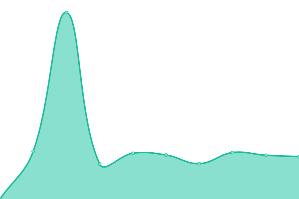

# [📈 Live Status](https://status.3deling.com): <!--live status--> **🟧 Partial outage**

This repository contains the open-source uptime monitor and status page for [3Deling-IT](https://status.3deling.com), powered by [Upptime](https://github.com/upptime/upptime).

With [Upptime](https://upptime.js.org), you can get your own unlimited and free uptime monitor and status page, powered entirely by a GitHub repository. We use [Issues](https://github.com/3Deling-IT/status/issues) as incident reports, [Actions](https://github.com/3Deling-IT/status/actions) as uptime monitors, and [Pages](https://status.3deling.com) for the status page.

<!--start: status pages-->
<!-- This summary is generated by Upptime (https://github.com/upptime/upptime) -->
<!-- Do not edit this manually, your changes will be overwritten -->
<!-- prettier-ignore -->
| URL | Status | History | Response Time | Uptime |
| --- | ------ | ------- | ------------- | ------ |
|  3Deling | 🟩 Up | [3-deling.yml](https://github.com/3Deling-IT/status/commits/HEAD/history/3-deling.yml) | 

 284ms
     
 | 

<a href="https://status.3deling.com/history/3-deling">100.00%</a>
    

|  Owncloud | 🟩 Up | [owncloud.yml](https://github.com/3Deling-IT/status/commits/HEAD/history/owncloud.yml) | 

 1386ms
     
 | 

<a href="https://status.3deling.com/history/owncloud">100.00%</a>
    

|  Support | 🟩 Up | [support.yml](https://github.com/3Deling-IT/status/commits/HEAD/history/support.yml) | 

 814ms
     
 | 

<a href="https://status.3deling.com/history/support">100.00%</a>
    

|  Web Pano | 🟩 Up | [web-pano.yml](https://github.com/3Deling-IT/status/commits/HEAD/history/web-pano.yml) | 

 840ms
     
 | 

<a href="https://status.3deling.com/history/web-pano">100.00%</a>
    

|  TVE | 🟩 Up | [tve.yml](https://github.com/3Deling-IT/status/commits/HEAD/history/tve.yml) | 

 698ms
     
 | 

<a href="https://status.3deling.com/history/tve">100.00%</a>
    

|  Sentry | 🟥 Down | [sentry.yml](https://github.com/3Deling-IT/status/commits/HEAD/history/sentry.yml) | 

 3877ms
     
 | 

<a href="https://status.3deling.com/history/sentry">100.00%</a>
    

|  ERP | 🟩 Up | [erp.yml](https://github.com/3Deling-IT/status/commits/HEAD/history/erp.yml) | 

 903ms
     
 | 

<a href="https://status.3deling.com/history/erp">100.00%</a>
    

|  Clients Portal | 🟩 Up | [clients-portal.yml](https://github.com/3Deling-IT/status/commits/HEAD/history/clients-portal.yml) | 

 1211ms
     
 | 

<a href="https://status.3deling.com/history/clients-portal">100.00%</a>
    

<!--end: status pages-->

[**Visit our status website →**](https://status.3deling.com)

## 📄 License

- Powered by: [Upptime](https://github.com/upptime/upptime)
- Code: [MIT](./LICENSE) © [3Deling-IT](https://status.3deling.com)
- Data in the `./history` directory: [Open Database License](https://opendatacommons.org/licenses/odbl/1-0/)
